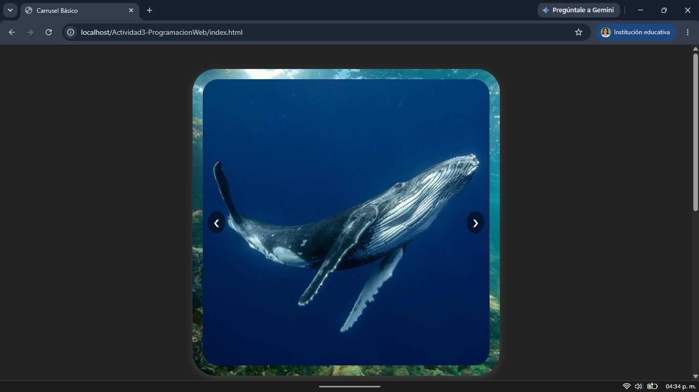
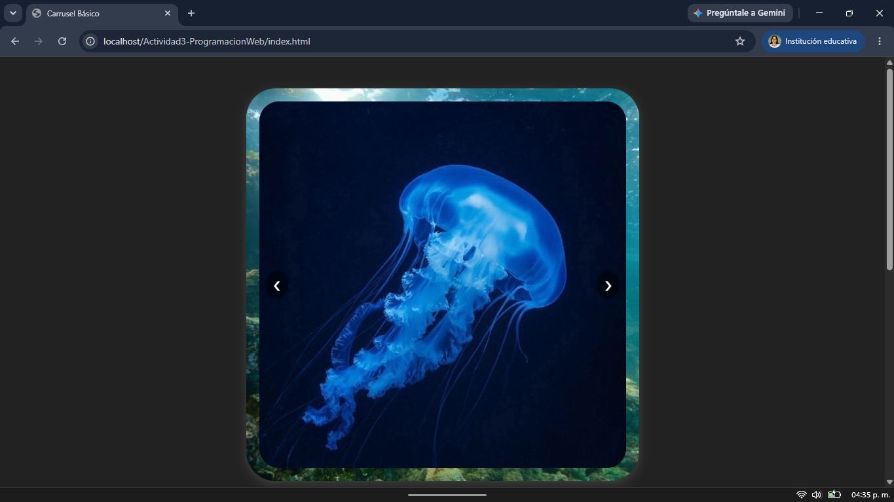
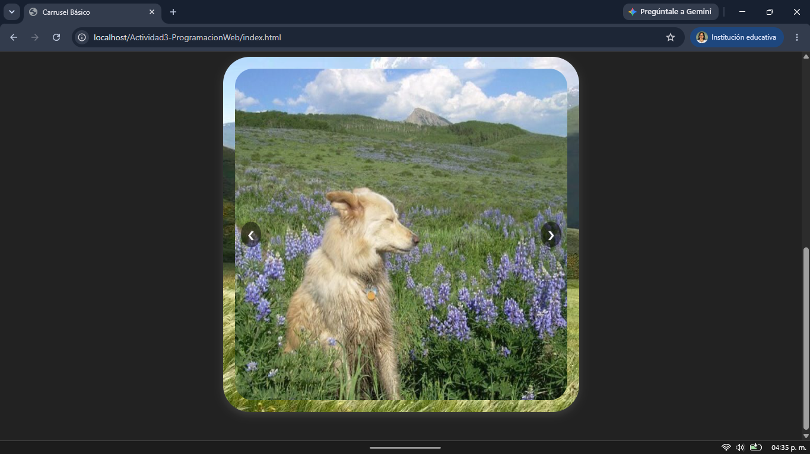
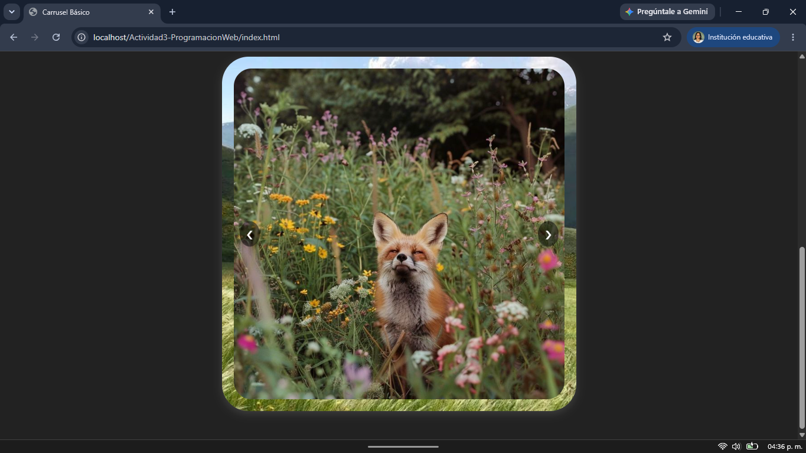

# Carrusel.js

Componente visual reutilizable para mostrar galerías de imágenes en cualquier sitio web. Resuelve el problema de mostrar múltiples imágenes en un pequeño espacio, sin que el usuario tenga que hacer scroll o desplazarse a lo largo de la pantalla, permite navegar entre ellas con flechas.

---

**Actividad 3 - Programación Web**

Tecnológico Nacional de México, Instituto Tecnológico de Oaxaca

**Alumna:** Pliego Mendez Alondra

## Instalación
Para la utilización de esta libreria descarga el archivo carrusel.js de la carpeta /js de este repositorio.
Además de descargar el archivo carrusel.css para que asigne adecuadamente los estilos a cada uno de los componentes.
Incluye estos archivos en el `<head>` y antes de cerrar `</body>` del HTML:
```html
<link rel="stylesheet" href="css/carrusel.css">
<script src="js/carrusel.js"></script>
```
## Uso
- En tu HTML, coloca un contenedor vacío con un id único por cada carrusel que quieras crear:
```html
<div class="carrusel" id="carrusel1"></div>
```
- Llama la función pasando el id, el arreglo de imágenes y el fondo base para el carrusel:
```html
<script>crearCarrusel('carrusel1',
            ['img/oc1.jpg', 'img/oc2.jpg', 'img/oc3.jpg','img/oc4.jpg','img/oc5.jpg','img/oc6.jpg', ],
            'img/fondo1.jpg'
        );</script>
```
Puedes usarlo cuantas veces sean necesarias, solo siempre recuerda crear el contenedor vacio con su correspondiente ID.

Nota: Ya sea que se mande a llamar la función dentro del mismo archivo .html aunque recomiendo el uso de un archivo intermedio .js que conecte con las funciones de la libreria carrusel.js y tu archivo .html. El archivo .css puede ser modificado a las necesidades del proyecto para el que se vaya a utilizar.
## Muestra de aplicación
Para esta muestra de aplicación, se han creado dos carruseles con un diferente paquete de imagenes para cada uno, el primero es con tematica de animales del oceano y el segundo con animales terrestres, especificamente de montañas o campo. Es así como demostramos la reutilziación del componente.




## Video de prueba de funcionamiento
https://youtu.be/yD86qDrWnes
## Links
### GitHub Pages
- https://alondrapliego.github.io/Actividad3-ProgramacionWeb/
### GitHub Repositorio
- https://github.com/AlondraPliego/Actividad3-ProgramacionWeb
## Estructura del repositorio
```
/Actividad3-PogramacionWeb
  - README.md
  - index.html
  /css
    - carrusel.css
  /js
    - carrusel.js
  /img
    - fondo1.png
```
## Referencias
Para el correcto desarrollo del componente se consideraron como base para la construcción del código los siguientes recursos:
- https://youtu.be/lpDAFrD_Rfg?si=C3hG-88ipAQJ3YB3
- https://youtu.be/2CEptqw-bSQ?si=4rfmUvPW5mt3YzXH